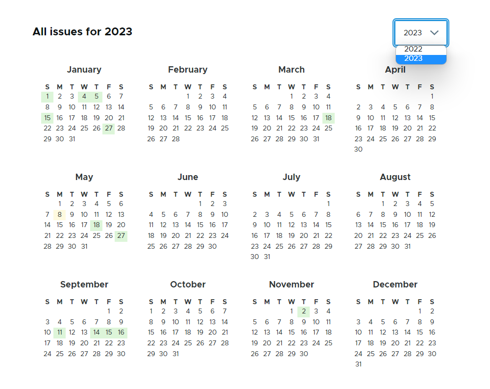

# FullCalendar Solr

## Table of contents

- [Introduction](#introduction)
- [Requirements](#requirements)
- [Installation](#installation)
- [Configuration](#configuration)
  - [Creating a Year View](#creating-a-year-view)
  - [Creating a Day View](#creating-a-day-view)
  - [Redirecting to a Single Result](#redirecting-to-a-single-result)
  - [Creating a Calendar Link Block](#creating-a-calendar-link-block)
- [Troubleshooting](#troubleshooting)

## Introduction

FullCalendar Solr provides integration with the
[FullCalendar](https://fullcalendar.io/) JavaScript library
to provide a Year Calendar View display formatter that is compatible with
Search API.

The calendar highlights dates associated with content. It also features a year
dropdown containing only years with results. This module is compatible
with the Search API Solr and Facets modules.

**Note:** This formatter is not compatible with regular content Views.

## Requirements

This module requires the following modules:

- [Search API](https://www.drupal.org/project/search_api)
- [Views](https://www.drupal.org/project/views)

The Search API backend needs to support the `search_api_facets` option.

## Installation

1. Clone this repo into `drupal/web/modules/contrib` or install using Composer.
1. Enable the module at `Admin > Extend` or use Drush.

## Configuration

### Creating a Year View

1. At `/admin/structure/views`, click `Add view`. Under `View settings > Show`,
select a Solr index.
1. Create a Page.
2. Set the Display Format to `FullCalendar Solr`.
1. Configure the page path such that the last component is 'year'.
(e.g. `/a/b/c/year`)
1. Under `Fields`, add a string field containing a date in YYYY-MM-DD format.
Any dates not in YYYY-MM-DD format will not be displayed in the calendar.
    - Ensure that the date field selected is an indexed field by the Solr Index chosen.
1. Under `Advanced > Contextual Filters`, select a filter containing year
values in YYYY format.
1. Edit the year contextual filter.
    1. Under `When the filter value is NOT available`, select
    `Provide default value`.
    1. Set the type to `Raw value from URL`
    2. Set the Path Component to the index of where `year` is located in the path. (e.g. for `/a/b/c/year`, the Path Component should be set to 4)
1. Under `Format > FullCalendar Solr Settings`, set the Date Field to the field created in step 5 and the Year Field to the field created in step 6.
1. Add any additional view configurations as needed.
1. Save the view.

### Creating a Day View

The year calendar can be configured to redirect to a day view when a
highlighted date is clicked.

1. Edit the year view page. Under `Format > FullCalendar Solr Settings`, check
the `Navigation Links to Day View` option and save.
1. Click `Add > Page`. This will be the new Day View.
1. Select a display style. (One that is not `FullCalendar Solr`)
1. Under `Advanced > Contextual Filter`, add a filter containing a string date
in YYYY-MM-DD format. This should be the same as the date field used in the
year view.
    - If the date field is not available, try adding the field to the Search
    API Index.
1. Configure the page path. The path of this view should be the same as the
path of the Year View except the last URL component is 'day' instead of 'year'
(i.e. if the year view has path `/a/b/c/year`, the day view must have path
`/a/b/c/day`).
1. Add any additional view configurations as needed.
1. Save the view.

### Redirecting to a Single Result

If a highlighted date has only one result, the year calendar can redirect to
the result itself instead of the day view.

1. **Prerequisites:** Navigation Links are enabled and a day view is set up.
(See [Creating a Day View](#creating-a-day-view))
1. Edit the Year View page.
1. Under `Fields`, add a field containing an item path or URL.
1. Under `Format > FullCalendar Solr Settings`, check the `Link to Item`
option.
1. The `Item URL Field` dropdown should now be available. Select the field
containing the item path or URL.
1. Save the formatter settings.
1. Save the view.

### Creating a Calendar Link Block

This is a method of dynamically generating a link to the calendar view when
a year is required (e.g. the default value of the year contextual filter is
set to `Raw value from URL`). The block can be set to link to the oldest/latest
year with results.

1. Edit the calendar view and select `Add Block`.
1. Under `Block settings`, set the `Block category` to `Lists (Views)`.
1. Under `Format`, set the format to `Unformatted list` and select to
show `Fields`.
1. If your calendar view has any contextual filters other than the year,
add them under `Contextual filters`.
    1. In the settings of each filter, under
    `When the filter value is NOT available`, select `Provide default value`.
    1. Set the type to `Raw value from URL` and set the path component number
    based on the path of where this block will be placed.
1. Under `Fields`, add a year field containing years in YYYY format.
1. Edit the year field.
    1. Set the `Thousands marker` to `None`.
    1. Go to the `Rewrite results` section.
        1. Check `Override the output of this field with custom text`.
        1. Under `Text`, customize your link text. E.g. `Calendar View`.
        1. Check `Output this field as a custom link`.
        1. Fill in the `Link path` field. Model this after the path of your
        calendar view using the Replacement patterns.
        E.g. `/node/{{ arguments.field_member_of }}/year/{{ year }}`.
        1. If using an absolute path, check `Use absolute path`.
        1. (Optional) Set the `Prefix text` and `Suffix text` options.
    1. Go to the `No results behavior` section. Check `Hide if empty` and
    `Hide rewriting if empty`.
1. Under `Pager`, set the pager to `Display a specified number of items`.
Set the `Items to display` field to 1.
1. Under `Filter criteria`, add `<Year Field> is not empty`.
1. Under `Sort criteria`, add the year field. Set the sort order to
ascending to get the oldest year, or descending to get the latest year.
1. Place the block within a view that has the contextual filters used by
the block.

## Troubleshooting

**The year calendar doesn't display all dates with content**
- Try going to `View settings > Pager options`, and set the
Items per page` option to 365.

**The calendar link block displays multiple links**
- This is likely because some of the results have more than one year value.
